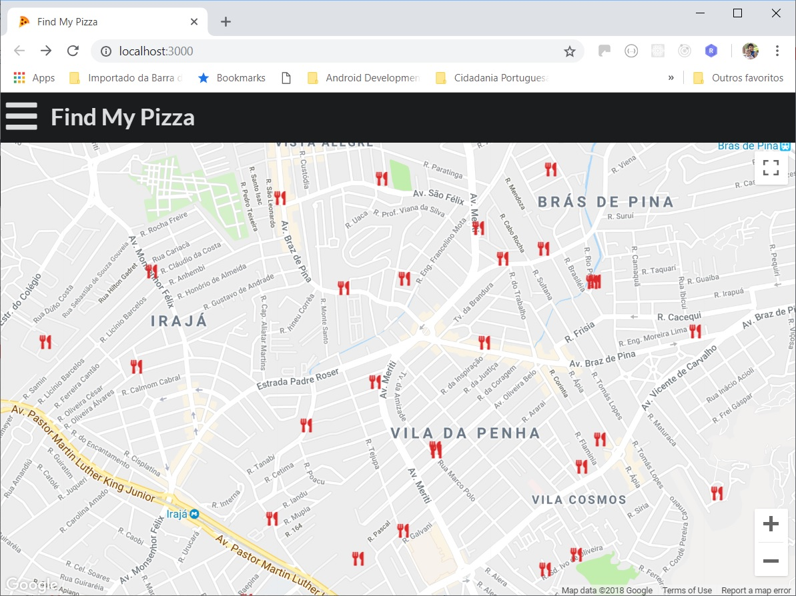
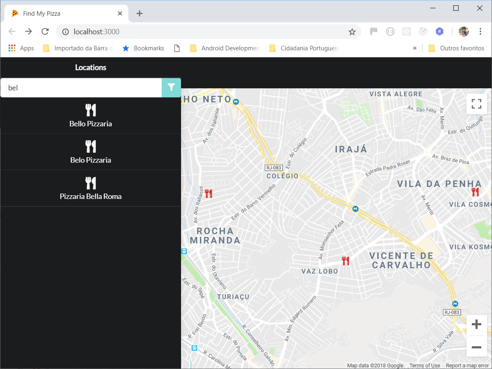
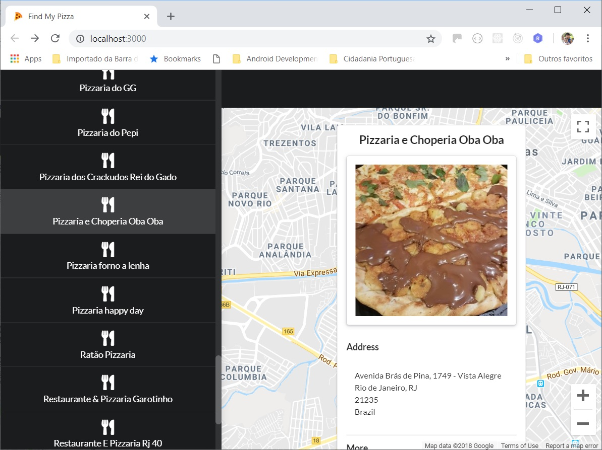
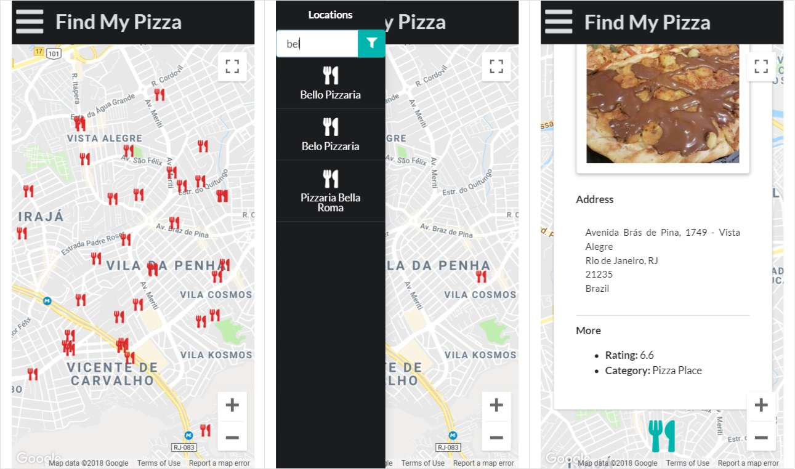

# Udacity Full-Stack Developer (Projeto 5) - Mapa do Bairro

Este projeto consiste num aplicativo de página única apresentando um mapa do bairro, incluindo locais em destaque, dados de terceiros sobre esses locais e diversas formas de navegar pelo conteúdo.

**Características:**
- [Google Maps API](https://cloud.google.com/maps-platform/maps/?hl=pt-BR) para exibição do mapa
- [Foursquare API](https://developer.foursquare.com/) para busca de POI's e detalhes
- App desenvolvido em [React.JS](https://reactjs.org/)
- Layout responsivo e compatível com celulares
- Uso de menu lateral para filtragem e navegação pelos POI's

**Imagens:**

<table align="center">
  <tr>
     <td>
       
       <p align="center">Tela Inicial</p>
     </td>
     <td>
       
       <p align="center">Filtro de POI's</p>
     </td>
  </tr>
  <tr>
     <td>
       
       <p align="center">InfoWindow</p>
     </td>
     <td>
       
       <p align="center">Otimizado para mobile</p>
     </td>
  </tr>
</table>

## Instalação:

* Instale [Node.js](https://nodejs.org/en/)
* Faça um clone do repositório
* Crie um arquivo `.env` na raiz na pasta clonada com o conteúdo:
```
REACT_APP_MAPS_API_KEY=<Google Maps API Key>
REACT_APP_FOURSQUARE_CLIENT_ID=<Foursquare API Client ID>
REACT_APP_FOURSQUARE_CLIENT_SECRET=<Foursquare API Client Secret>
```
 **OBS**: Esse app requer uma chave de developer para o uso tanto da Google Maps API quanto da Foursquare API. Instruções [aqui](https://developers.google.com/maps/documentation/javascript/get-api-key) e [aqui](https://developer.foursquare.com/docs/api). Para a Google Maps API também é preciso selecionar **Referenciadores HTTP (websites)** em **restrições de aplicativos** e incluir `http://localhost:3000/` como um referenciador HTTP autorizado no [Developers Console](https://console.developers.google.com/apis/dashboard)

* Abra a pasta do projeto e inicialize o app
    - `cd <pasta do projeto>`
    - `npm install`
    - `npm start`

## Create React App

Este projeto foi gerado com [Create React App](https://github.com/facebookincubator/create-react-app). Mais informações [aqui](https://github.com/facebookincubator/create-react-app/blob/master/packages/react-scripts/template/README.md).

## Semantic UI React

A interface do usuário deste projeto foi desenvolvida com o framework [Semantic UI React](https://react.semantic-ui.com/).

## `google-map-react`

A interface do mapa utiliza [`google-map-react`](https://www.npmjs.com/package/google-map-react) que é um componente público que permite renderizar qualquer componente React no Google Map.

## Copyright

Esse projeto foi desenvolvido por Márcio Souza de Oliveira.
